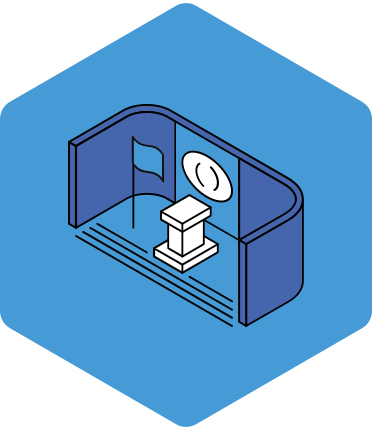
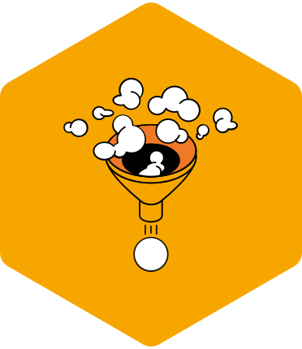
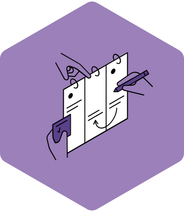
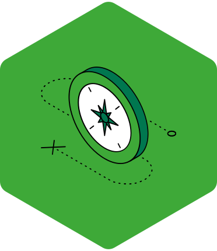
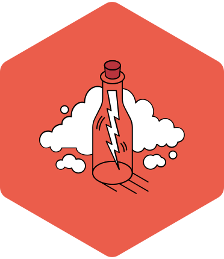

<h1 align="center">XQ Competencies</h1>

<p align="center">
  A research-backed, durable skill framework for high school education.<br>
  Developed by <a href="https://xqsuperschool.org/">XQ Institute</a>.
</p>

<p align="center">
  <a href="https://xqcompetencies.xqsuperschool.org/">Explore the Framework</a> &bull;
  <a href="https://learning.xq.institute/">Learn More</a> &bull;
  <a href="data/">Download the Data</a> &bull;
  <a href="mailto:support@xqinstitute.org">Contact Us</a>
</p>

---

## What Are the XQ Competencies?

Today's young people are growing up in an increasingly complex world, and the ways they learn are evolving accordingly.

Recent advances in neuroscience, cognitive psychology, and the learning sciences have shed new light on how adolescents learn. Adolescence is a time of great cognitive malleability and growth. Learning across all domains — academic, cognitive, social, and emotional — is deeply affected by relationships, a sense of belonging, and engagement in rigorous and relevant learning experiences. All these domains are deeply intertwined.

At XQ, we believe that when high schools design experiences that honor this rich complexity, students become more engaged, explore more deeply, and ultimately develop the knowledge, skills, and mindsets they need to succeed in college, career, and beyond.

The framework is organized as a three-level hierarchy:

```
Learner Outcome  →  Competency  →  Component Skill (with 4 progression levels)
```

### The Five Learner Outcomes

<table>
  <tr>
    <td align="center" valign="top" width="20%"><br><strong>FK</strong><br>Holders of Foundational Knowledge</td>
    <td align="center" valign="top" width="20%"><br><strong>FL</strong><br>Masters of All Fundamental Literacies</td>
    <td align="center" valign="top" width="20%"><br><strong>GC</strong><br>Generous Collaborators for Tough Problems</td>
    <td align="center" valign="top" width="20%"><br><strong>LL</strong><br>Learners for Life</td>
    <td align="center" valign="top" width="20%"><br><strong>OT</strong><br>Original Thinkers for an Uncertain World</td>
  </tr>
</table>

Each learner outcome contains multiple **competencies** (37 total), which in turn contain **component skills** (115 total). Every component skill includes four progression levels — Emerging, Developing, Proficient, and Applying — so educators can track student growth over time.

Every competency is backed by **research sources** (139 citations) linking to peer-reviewed literature and foundational texts.

## Resources

- **[XQ Competency Navigator](https://xqcompetencies.xqsuperschool.org/)** — Explore the full framework interactively online.

## What's in This Repository

```
data/                     Framework data as CSV files
├── learner_outcomes.csv    5 top-level learning goals
├── competencies.csv        37 competencies with definitions
├── component_skills.csv    115 skills with 4 progression levels
├── research_sources.csv    139 research citations
└── README.md               Column docs, relationships, usage examples

icons/                    37 competency hexagon icons (SVG)
```

The CSV files in [`data/`](data/) are relational — join them on `id`, `competency_id`, and `learner_outcome_id`. See [`data/README.md`](data/README.md) for complete column documentation and usage examples in Python, R, and SQL.

The competency icons in [`icons/`](icons/) are SVGs named `{id}_{name}.svg` (e.g., `FK.AC.1_artistic-expression.svg`).

## Versioning

This repository uses [semantic versioning](https://semver.org/). Each release includes a git tag and a [GitHub Release](https://github.com/xq-labs/xq-competencies/releases). See [`CHANGELOG.md`](CHANGELOG.md) for the full version history.

## Working with XQ

Interested in implementing or adapting the XQ Competencies? We'd be glad to collaborate.

**Contact:** [support@xqinstitute.org](mailto:support@xqinstitute.org)
**Learn more:** [xqsuperschool.org](https://xqsuperschool.org/)

## License

© 2026 XQ Institute. Licensed under [CC BY 4.0](https://creativecommons.org/licenses/by/4.0/).

XQ has released the XQ Competencies under a Creative Commons Attribution (CC BY 4.0) license, enabling anyone to use, share, and adapt the framework—with attribution—for any purpose. Our goal is to support broad use and adaptation in service of meaningful, engaging, real-world learning experiences that build durable skills. If you modify or build from the competencies, please indicate that changes were made and do not imply endorsement by XQ Institute.

**Recommended attribution:**
When using this material, please credit: [XQ Competencies](https://xqsuperschool.org/) © XQ Institute. Licensed under CC BY 4.0.

If possible, also include a link to the [canonical repository](https://github.com/xq-labs/xq-competencies).

"XQ Institute", "XQ", and associated logos are trademarks of XQ Institute and are not licensed under CC BY 4.0. See [NOTICE.md](NOTICE.md) for full attribution requirements and trademark guidance.
